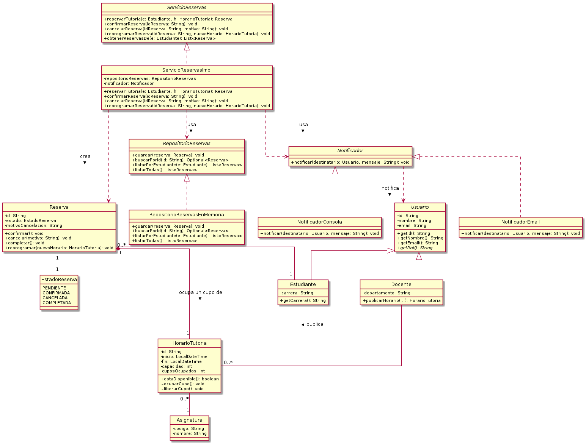

# Sistema de Gestión de Tutorías

UEES · Diseño de Software (UCOM0310) · Actividad 5 (Ae1) — Diseño orientado a objetos de un sistema
Autor: Joffre Barre Veliz

## Propósito

Modelo orientado a objetos de un sistema que permite a **estudiantes** solicitar tutorías sobre los **horarios** que publican los **docentes**, controlando la disponibilidad de cupos y el ciclo de vida de cada **reserva** (pendiente, confirmada, cancelada, completada), sin acoplar la lógica de negocio a una tecnología concreta de persistencia o de notificación.

## Descripción breve del problema

Un docente publica horarios disponibles para una asignatura. Un estudiante solicita una tutoría sobre uno de esos horarios; la solicitud queda **pendiente** hasta que se confirma. Un horario tiene una capacidad máxima de cupos y no debe aceptar más reservas de las que puede atender. Una reserva puede confirmarse, cancelarse (con motivo) o reprogramarse a otro horario, y ambos —estudiante y docente— deben ser notificados de los eventos relevantes. La persistencia y la notificación deben poder cambiar de tecnología sin modificar las reglas de negocio.

## Clases principales y responsabilidades

| Clase / interfaz | Responsabilidad |
|---|---|
| `Usuario` (abstracta) | Identidad y datos comunes (id, nombre, email validado); generalización de la que derivan `Estudiante` y `Docente`. |
| `Estudiante` | Representa al solicitante de tutorías; agrega su carrera. |
| `Docente` | Publica horarios de tutoría (`publicarHorario`) para una asignatura. |
| `Asignatura` | Materia sobre la que se ofrece tutoría. |
| `HorarioTutoria` | Franja horaria publicada por un docente; protege su propia regla de disponibilidad (`estaDisponible`, `ocuparCupo`, `liberarCupo`). |
| `Reserva` | Núcleo del dominio: encapsula la máquina de estados de una tutoría (`confirmar`, `cancelar`, `completar`, `reprogramar`) y sus invariantes. |
| `EstadoReserva` | Enumeración de los estados posibles de una reserva. |
| `RepositorioReservas` (interfaz) | Puerto de persistencia de reservas (abstracción, no implementación). |
| `RepositorioReservasEnMemoria` | Implementación de persistencia en memoria (intercambiable). |
| `Notificador` (interfaz) | Puerto de comunicación de eventos hacia un `Usuario`. |
| `NotificadorEmail` / `NotificadorConsola` | Implementaciones concretas del canal de notificación. |
| `ServicioReservas` / `ServicioReservasImpl` | Orquesta los casos de uso (reservar, confirmar, cancelar, reprogramar), delegando las reglas en el dominio y las dependencias técnicas en las abstracciones inyectadas. |

## Decisiones de diseño relevantes

- **Reserva y HorarioTutoria protegen sus propias reglas.** La disponibilidad de cupos y las transiciones válidas de estado (por ejemplo, que solo una reserva `PENDIENTE` pueda confirmarse) viven dentro de esas clases, no en el servicio. Esto concentra en un solo lugar cada regla de negocio y evita que se dupliquen o se olviden.
- **Composición sobre herencia para `Reserva`–`HorarioTutoria`–`Docente`.** Una reserva "usa" un horario y un horario "pertenece" a un docente; no hay una relación ES-UN entre ellos, así que se modelan como composición/asociación, no como herencia.
- **Herencia solo donde hay una relación ES-UN real.** `Estudiante` y `Docente` heredan de `Usuario` porque ambos comparten identidad y comportamiento (no se usó herencia únicamente para reutilizar código).
- **Persistencia y notificación como abstracciones inyectadas.** `ServicioReservasImpl` recibe `RepositorioReservas` y `Notificador` por constructor; nunca crea sus implementaciones con `new`. Cambiar la tecnología de persistencia (memoria → base de datos) o de notificación (consola → correo → SMS) no requiere tocar el servicio ni el dominio.

## Principios SOLID aplicados

1. **DIP (Dependency Inversion Principle):** `ServicioReservasImpl` depende de las interfaces `RepositorioReservas` y `Notificador`, nunca de `RepositorioReservasEnMemoria` ni de `NotificadorEmail` directamente. Las implementaciones concretas se ensamblan una sola vez, en `App`. Esto evita que un cambio de tecnología de persistencia o de canal de notificación obligue a modificar la lógica de negocio.
2. **OCP (Open/Closed Principle):** agregar un nuevo canal de notificación (por ejemplo SMS) solo requiere crear una nueva clase que implemente `Notificador`; ni `Notificador`, ni `ServicioReservasImpl`, ni ninguna otra clase existente se modifican. El sistema queda abierto a extensión y cerrado a modificación.
3. **SRP (Single Responsibility Principle):** las reglas de negocio (`Reserva`, `HorarioTutoria`), la orquestación de casos de uso (`ServicioReservasImpl`), la persistencia (`RepositorioReservasEnMemoria`) y la notificación (`NotificadorEmail`/`NotificadorConsola`) son responsabilidades separadas en clases distintas; cada una cambia por una sola razón.

Ver el documento de análisis (PDF entregado en Blackboard) para el detalle de cohesión, acoplamiento y la justificación completa de SOLID.

## Diagrama UML

Ver [`docs/modelo-clases.puml`](docs/modelo-clases.puml) (fuente PlantUML) y [`docs/modelo-clases.png`](docs/modelo-clases.png) (imagen renderizada).



## Requisitos para ejecutar el proyecto

- JDK 17 o superior
- Maven 3.8+

## Compilación

```bash
mvn clean compile
```

## Pruebas

```bash
mvn clean test
```

## Ejecutar la demostración de consola

```bash
mvn compile exec:java
```

## Estructura del repositorio

```
sistema-tutorias/
├── README.md
├── pom.xml
├── docs/
│   ├── modelo-clases.puml
│   └── modelo-clases.png
└── src/
    ├── main/java/edu/uees/tutorias/
    │   ├── App.java
    │   ├── domain/            (Usuario, Estudiante, Docente, Asignatura,
    │   │                        HorarioTutoria, Reserva, EstadoReserva)
    │   ├── domain/repository/ (RepositorioReservas — puerto)
    │   ├── service/           (ServicioReservas, ServicioReservasImpl)
    │   ├── notification/      (Notificador, NotificadorEmail, NotificadorConsola)
    │   └── persistence/       (RepositorioReservasEnMemoria)
    └── test/java/edu/uees/tutorias/service/
        └── ServicioReservasImplTest.java
```

## Declaración de uso de inteligencia artificial

Durante el desarrollo de esta actividad utilicé herramientas de inteligencia artificial (Claude, Anthropic) como apoyo para redactar el esqueleto de clases Java, el diagrama PlantUML y la documentación. Verifiqué y adapté el código y las decisiones de diseño presentadas, compilé el proyecto y ejecuté la demostración para confirmar que el comportamiento es el esperado, y puedo explicar y justificar cada clase, relación y decisión de este repositorio.
